 

<!-- Se quiser usar um GIF no topo, descomente a linha abaixo -->
<!--  -->

---

### 💜 About Me

I'm **Jota**, a **Systems Analysis and Development student**, interested in cybersecurity and expanding my knowledge in the field.

I'm currently improving my skills in **Java, Python, C++, and Linux**, putting what I learn into practice through academic projects.

I aim to build a career in **IT, focusing on cybersecurity**, developing my technical skills and deepening my knowledge of information security.

---

<h3 align="left">Connect with me!</h3>

 

<h3 align="left">My Stack ~</h3>

 

---

### * GitHub Stats *

 

---

### 🐍 My Contributions

 

<picture>
  <source media="(prefers-color-scheme: dark)" srcset="https://raw.githubusercontent.com/joaopedro120107-lgtm/joaopedro120107-lgtm/output/github-contribution-grid-snake.svg">
  <source media="(prefers-color-scheme: light)" srcset="https://raw.githubusercontent.com/joaopedro120107-lgtm/joaopedro120107-lgtm/output/github-contribution-grid-snake.svg">
  
</picture>

---

💜 Always learning, always evolving.

